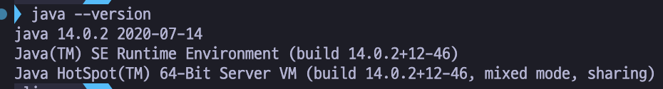
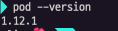

# 1. 리액트 네이티브 개발 환경 갖추기

## 1. 리액트 네이티브 프레임워크 소개

---

### 네이티브가 뭔데?

: 운영체제를 만들 때 사용한 프로그래밍 언어와 똑같은 언어로 만든 앱

⇒ 안드로이드(Java), iOS(Objective-C)와 같이 구체적인 플랫폼을 위해 만들어진 응용 프로그램

- _사용자에게 빠르고 안정적인 환경을 제공한다._
- _다양한 네이티브 기능을 쉽게 활용할 수 있다. (카메라, GPS 등)_

<aside>
⛔ **네이티브의 단점**

</aside>

- 습득해야 할 지식이 많다.
- 똑같은 기능의 앱을 안드로이드용, iOS용 따로 만들어야 한다.

**⇒ 많은 시간과 비용이 소요**

### 네이티브의 단점을 해결할 크로스 플랫폼

<aside>
💡 **하나의 소스 코드로 여러 운영체제에서 동작하는 앱을 개발하자**

</aside>

- 개발 시간과 비용을 크게 절약할 수 있다.
- 단, 네이티브 앱보다 실행 속도는 조금 느리다.

### 리액트 네이티브 프레임워크

: 안드로이드와 iOS 운영체제에서 모두 동작하는 프레임워크.

- `네이티브 파트`와 `자바스크립트 파트`로 구성됩니다.
- **브릿지 방식**으로 동작한다.
  - 안드로이드와 iOS 개발 프레임워크는 이름에 ‘View’가 들어간 많은 클래스를 제공한다.
  - 리액트 네이티브는 웹 브라우저에서 자바스크립트 코드로 구현된 ‘View’ 클래스를 네이티브 쪽 안드로이드(or iOS) 프레임워크의 ‘View’ 클래스 호출로 연결하는 방식

### 목표 : 타입스크립트를 사용해서 리액트 네이티브 앱을 만들자

<aside>
🤔 자바스크립트는 **타입 기능이 없는 언어**이다.

</aside>

- 개발자의 사소한 입력 오류 등을 알아채지 못한다.
  ⇒ 어디서 어떤 오류가 발생했는지 알기 어렵다.

“**이를 해결할 수 있는 타입스크립트”**

⇒ 자바스크립트와 100% 호환하면서도 타입 기능을 제공한다.

## 2. 맥에서 개발 환경을 갖추자

---

### Homebrew 설치

Homebrew : 맥 용 설치 프로그램

[Homebrew](https://brew.sh/)

`/bin/bash -c "$(curl -fsSL https://raw.githubusercontent.com/Homebrew/install/HEAD/install.sh)"`

### VSCode 설치

`brew install cask`

`brew install --cask visual-studiio-code`

### Node.js 설치

1. nvm 설치

   `brew install wget`

   `touch $HOME/ .zshrc`

   `sudo curl -o- https://raw.githubusercontent.com/creationix/nvm/v0.33.1/install.sh | bash`

   `source .zshrc`

2. Node.js 설치

   `nvm install --lts`

   `node -v`

   

   설치 완료

### 자바11 JDK 설치

<aside>
💡 리액트 네이티브 안드로이드 개발에는 안드로이드 SDK 빌드 도구가 필요하다.

</aside>

⇒ 안드로이드 빌드 도구는 **자바 버전 11 JDK**가 설치되어야 동작한다.

1. 설치

   `brew tap homebrew/cask-versions`

   `brew install --cask termurin11`

2. .zshrc 파일을 편집하자

   `code $HOME/ .zshrc`

   아래의 코드를 마지막 줄에 삽입하자.

   ```
   export JAVA_HOME=/Library/Java/JavaVirtualMachines/temurin-11.jdk/Contents/Home
   ```

3. .zshrc 파일을 저장하고 다음 명령을 실행하자.

   `source .zshrc`

4. 환경 변수 설정을 확인하자.

   `echo $JAVA_HOME`

   

   `java --version`

   - Trouble Shooting
     
     똑같이 openjdk 11을 다운받아 설치했지만, 자바 11버전이 아닌 14 버전이 설치되었다.
     **[다른 버전으로 설정해보자]**

     1. 11 버전이 설치되어있는지 먼저 확인

        `/usr/libexec/java_home -V`

        

        ⇒ 둘 다 설치되어 있음을 확인할 수 있다.

     2. 버전을 변경하자.

        `export JAVA_HOME=$(/usr/libexec/java_home -v 11)`

     3. 확인

        `java --version`

        

        ⇒ 버전이 정상적으로 바뀜을 확인 할 수 있다.
        [참고링크](https://coding-zzang.tistory.com/30)

### Xcode 설치

<aside>
💡 리액트 네이티브 iOS 개발에는 Xcode가 필요하다.

</aside>

1. 개발자 계정을 만들자

   [Apple Developer](https://developer.apple.com/)

2. apple store에서 설치하기
3. CocoaPods 오류 발생 방지

   ⇒ Xcode 업데이트에 따라 명령 줄 도구가 제대로 설정되지 않으면 오류가 발생할 수 있다.

   - [Xcode → Preferences → Locations]로 이동
   - Command Line Tools에 Xcode를 지정한다.

### 코코아팟 설치

<aside>
💡 리액트 네이티브 iOS 앱 빌드를 위해서 코코아팟이 필요하다.

</aside>

- 코코아팟 : 원격 저장소에 호스팅된 각종 패키지를 내려받아 설치한다.

`sudo gem install cocoapods`

- Trouble Shooting
  
  도중에 설치가 중단되었다.
  
  에러 메시지에서 발생한 대로 gem install activesupport -v 6.1.7.4 명령어를 쳐도 에러 발생..
  [맥북(Macbook)에서 While executing gem ... (Gem::FilePermissionError) 에러가 발생할때](https://happymemoryies.tistory.com/21)
  위 링크따라 경로까지 설정해주니 설치에 성공했다.

`pod --version`



### 워치맨 설치

- 워치맨 : VSCode 편집기에서 소스 파일을 변경한 내용을 탐지하여 변경된 내용을 시뮬레이터 앱에 자동으로 반영한다.

`brew install watchman`

`watchman --version`


### 안드로이드 스튜디오 설치

[Android 스튜디오 설치  |  Android Developers](https://developer.android.com/studio/install?hl=ko)

.zshrc 파일 편집

1. VScode 실행 : `code $HOME/ .zshrc`
2. 다음 내용을 삽입한다.

   ```
   export ANDROID_SDK_ROOT=$HOME/Library/Android/sdk
   export PATH=$PATH:$ANDROID_SDK_ROOT/emulator
   export PATH=$PATH:$ANDROID_SDK_ROOT/tools
   export PATH=$PATH:$ANDROID_SDK_ROOT/tools/bin
   export PATH=$PATH:$ANDROID_SDK_ROOT/platform-tools
   ```

3. `source .zshrc` 실행

- +) .zshrc가 뭘까?
  **.zshrc 파일**
  : macOS와 Linux 시스템에서 사용되는 셸인 Zsh 셀을 시작할 때 자동으로 로드되는 스크립트 파일.
  - 사용자 지정 환경 설정, 셸 옵션, Alias 함수(명령어를 단축어로 정의하는 기능), 환경 변수 등을 정의하는 데 사용

## 3. 비주얼 스튜디오 코드 환경 설정과 사용법

---

### 한국어 언어 팩 설치

- Extensions에서 Korean을 입력하여 한국어 언어 팩을 설치하자.
  

### 타입스크립트 설치

`npm i -g npm`

`npm i -g typescript ts-node`

### 여러 개의 터미널 세팅해놓기

- 리액트 네이티브를 개발할 때는 여러 개의 터미널을 열고 작업한다.

책갈피 아이콘을 눌러 터미널을 분할해놓자.


### (윈도우 전용) touch 프로그램 사용하기

- touch : 파일을 생성하는 유틸리티, 맥은 기본으로 있지만, 윈도우는 설치가 필요하다.

`scoop install touch`

### prettier 확장 기능 설치 및 동작 환경 설정

- prettier : 린트 프로그램.


파일을 저장할 때 자동으로 prettier를 실행하도록 추가하자.

1. setting.json 파일 열기

   `cmd + shift + p`

2. 다음 코드를 settings.json 파일에 추가하자.

   ```json
   "editor.formatOnSave": true,
   "[typescript]" : {
   	"editor.formatOnPaste": true,
   	"editor.formatOnSave": true,
   	"editor.defaultFormatter": "esbenp.prettier-vscode"
   },
   ```

<aside>
💡 // prettier-ignore 주석

</aside>

- prettier을 적용하고 싶지 않은 줄 위에 `// prettier-ignore` 을 달면 다음 행에는 prettier 기능이 적용되지 않는다.

## 첫번째 모바일 앱 생성하기

---

- 리액트 네이티브 프로젝트는 같은 소스 코드를 안드로이드 슈튜디오, Xcode에서 각자 빌드한다.

### 안드로이드 앱 만들기


`Phone` → `Pixel 3a`를 선택한다


Recommended 옆 탭을 누르고 `API 29`, Target은 `Android 10.0` 항목을 찾아 다운로드 한다.


Graphics → Software

Enable Device Frame 선택 해제

- **API 29를 선택하는 이유?**
  : 리액트 네이티브는 API 28, 29에서 안정적으로 동작한다. 또한 다크모드 구현은 iOS 13, Android X부터 제공하는 기능임을 참고하자.


화면이 정상적으로 나타났다.

### 안드로이드 앱 프로젝트 생성


`Bottom Navigation Views Activity` 선택


원하는 경로 지정 후, Language를 `Java`로 변환한다.


빌드가 끝난 후 `Run`(화살표)를 누르면 실행된다.

### 안드로이드 에뮬레이터 초기화하기

- 간혹 npm run android 명령을 실행할 때 오류 메시지(INSTALL_FAILED_INSUFFICIENT_STORAGE)가 발생할 수 있다.
  ⇒ 저장 공간이 부족해 발생하는 오류

<aside>
💡 에뮬레이터를 초기화 시키자

</aside>

1. 에뮬레이터 종료 후 AVD Manager를 실행한다.
2. `Wipe DA`을 선택한다.

⇒ 에뮬레이터를 초기화한 다음에는 프로젝트를 종료하고 다시 시작하자.

### iOS 앱 만들기

- Xcode iOS 앱 프로젝트 생성


New Project를 실행하고 `Document App`을 선택한다.


iOS 13 버전 운영체제가 동작하는 `iPhone 13`, `iPhone 13 Pro` 등을 선택하고 실행한다.


화면이 정상적으로 나타났고, 만든 iosApp이 나와있다.

### 아이폰 시뮬레이터 초기화하기

- Simulator 메뉴의 Device → Erase All Content and Settings 메뉴를 실행하면 초기화된다.

### 타입스크립트로 개발하는 리액트 네이티브 프로젝트 만들기

- `npx react-native init` : 리액트 네이티브 프로젝트 만들기
- `npx react-native init {프로젝트명} --template react-native-template-typescript` : 타입스크립트 버전 리액트 네이티브 프로젝트 설치
