# 2. 리액트 네이티브 기본 다지기

## 1. 리액트 네이티브 프레임워크의 작동 원리

---

> `Hello world`를 화면에 출력해보며 리액트 네이티브 앱의 동작 원리를 알아보자

### 프로젝트 만들기

- 리액트 네이티브 프로젝트 ch02_1 생성
  `npx react-native init ch02_1 --template react-native-template-typescript`
- Trouble Shooting
  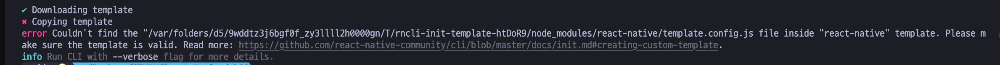
  시작부터 오류 발생. template을 찾을 수 없댄다.
  [Couldn't find template.config.js file inside "react-native" template. Please make sure the template is valid · Issue #1637 · react-native-community/cli](https://github.com/react-native-community/cli/issues/1637)
  `npx react-native init ch02_1 --template react-native-template-typescript --npm`
  ⇒ 뒤에 `--npm`을 붙이니 되었다.
  이번엔 cocoapods가 설치되지 않는 오류 발생
  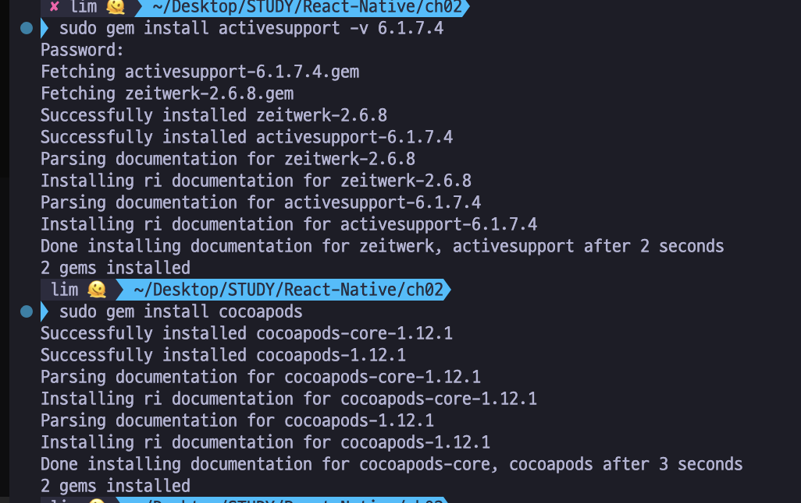

**[ 엄청 오래 걸렸지만 그래도 성공 ]**

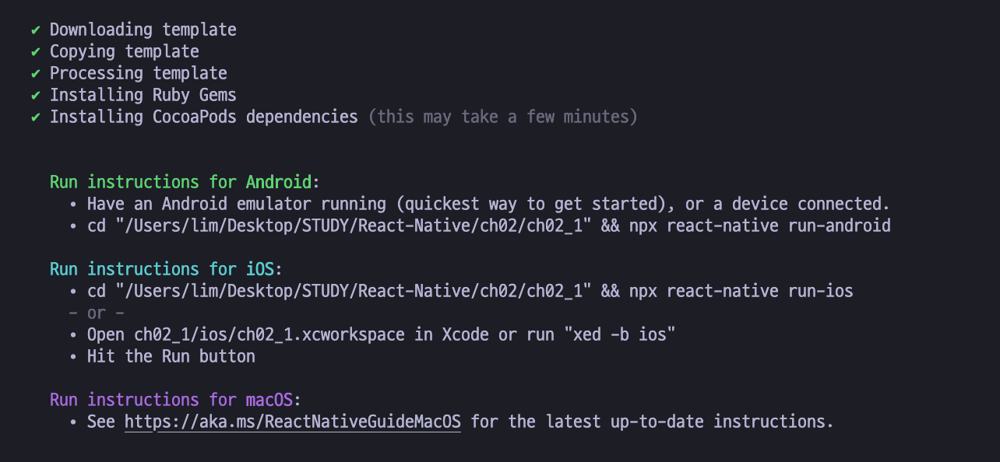

### 프로젝트 실행하기

- npm start
- npm run android
  - Trouble Shooting
    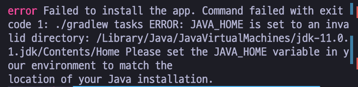
    왜 너만 이러니!
    **경로 문제라니까 경로를 다시 설정해주자**
    - 터미널에 입력
      → `export JAVA_HOME=/Library/Java/JavaVirtualMachines/jdk-11.0.16.jdk/Contents/Home`
- npm run ios

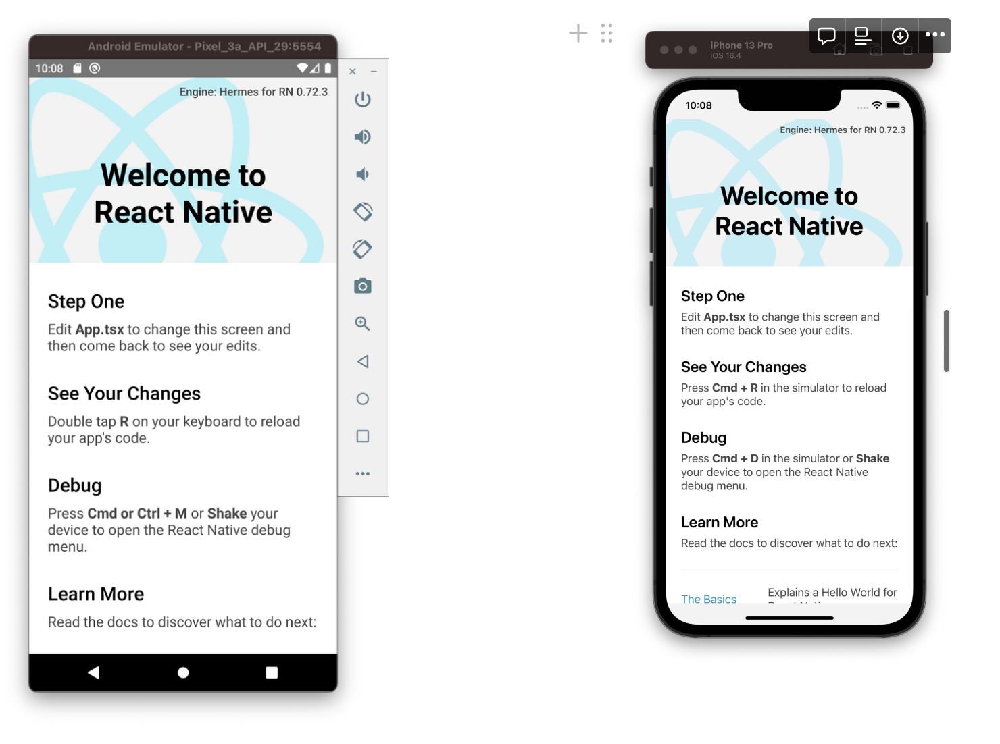

### App.tsx 파일

```tsx
import React from 'react';
import { Text } from 'react-native';

export default function App() {
	// console.log('App called');
	const textElement = React.createElement(Text, null, 'Hello world!');
	return textElement;
}
```

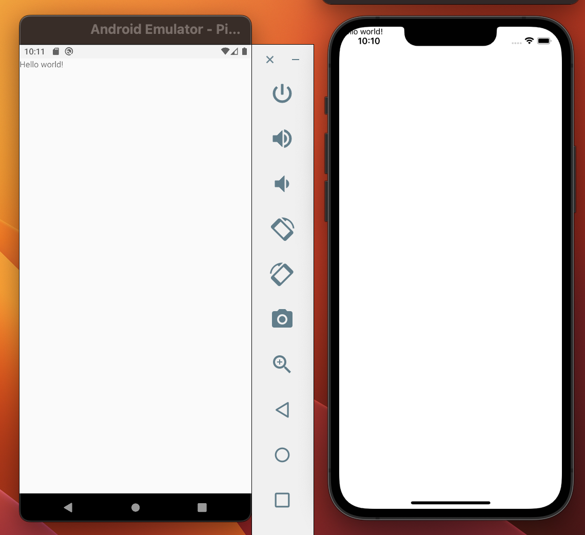

⇒ Hello World가 뜨는 것을 볼 수 있다!

<aside>
💡 **정적 HTML과 동적 HTML**

</aside>

- 정적 HTML : 웹 서버에서 HTML 문서를 생성하여 웹 브라우저로 전송하는 방식
- 동적 HTML : 웹 브라우저에서 자바스크립트 코드를 실행하여 동적으로 HTML을 생성하는 방식

⇒ React와 같은 프론트엔드 프레임워크는 동적 HTML 방식이다.

### DOM과 렌더링

- DOM 객체
  : DOM 클래스의 인스턴스
- DOM (트리) 구조
  : 무수히 많은 DOM 객체들이 부모/자식 형태의 나무 구조를 이루는 것.
- 렌더링
  : 웹 브라우저가 HTML을 파싱하여 자바스크립트 DOM 구조로 만드는 것

**[ 물리 DOM과 가상 DOM ]**

- 리액트 프레임워크에서 사용하는 개념
- 물리 DOM 구조
  : 웹 브라우저에서 자바스크립트 코드가 생성하는 실제 DOM 구조
- 가상 DOM 구조
  : 리액트 코드가 생성한 자바스크립트 객체 구조

⇒ 리액트는 특정 시점에서 가상 DOM 구조를 물리 DOM 구조로 바꾼다. : `리액트가 렌더링한다.`

→ 이를 수행하는 패키지 : `렌더러`

<aside>
💡 **리액트 프레임워크와 리액트 네이티브 프레임워크의 차이**

</aside>

- 리액트 : 가상 DOM 구조를 react-dom이란 렌더러(DOM 렌더러) 패키지를 사용
- 리액트 네이티브 : react-native 렌더러(네이티브 렌더러) 패키지를 사용

**[ react 패키지의 역할 ]**

- react 패키지 : App.tsx 파일을 가상 DOM 구조로 만드는 역할
- 네이티브 렌더러 : 리액트 요소를 안드로이드 프레임워크, iOS용 UIKit 프레임워크의 화면 UI 객체로 바꿔줌.

**[ 브리지 방식 렌더링 ]**

- 리액트에서는 React.render라는 DOM 렌더러의 동작을 코드로 확인할 수 있지만, 리액트 네이티브는 네이티브 렌더러의 모습을 확인할 수 **없다.**
  - **렌더링이 android와 ios 디렉토리에 있는 자바나 오브젝티브-C로 구현한 네이티브 모듈 쪽에서 되기 때문이다.**
- 네이티브 모듈
  - JavaScriptCore 자바스크립트 엔진이 동작
    ⇒ 안드로이드에서는 JNI 방식, iOS에서는 FFI 방식으로 연결되어 동작한다.
    - JNI : Java Native Interface
    - FFI : Foreign Function Interface
- 리액트 네이티브를 앱에서 실행하면, 네이티브 모듈 + 스레드 2개가 동시에 동작
  - 네이티브(안드, iOS 렌더링)를 담당하는 **UI 스레드**와 App.tsx와 같은 자바스크립트 코드를 실행하는 **자바스크립트 엔진 스레드**
  - 두 스레드는 메시지 큐 방식으로 서로 렌더링과 관련된 데이터를 주고 받는다.
  - 사용자가 화면을 터치 → UI 스레드가 자바스크립트 스레드에 이벤트 형식으로 전달
    ⇒ \*\*\*\*`브리지 방식 프레임워크`
- 네이티브 동작 부분 설치 : `npx react-native link`, `npx pod-install`

<aside>
💡 **엔진과 라이브러리 차이**

</aside>

- 일반적으로 같은 개념이나, 보통 코드 분량이 방대한 라이브러리를 엔진이라고 부른다.

<aside>
💡 **스레드란?**

</aside>

- 자바스크립트 엔진 : 단일 스레드
- 리액트 네이티브 앱 : 다중 스레드

**[ React.createElement API가 하는 일 ]**

document.createElement는 물리 DOM 객체를 생성하나, React.createElement는 가상 DOM 객체 생성

- 리액트 네이티브 렌더러는 네이티브에서 동작하므로 가상 DOM 객체를 네이티브로 넘겨주는 방식이다.
- react-native-cli는 네이티브 모듈에서 동작하는 자바스크립트 엔진이 가상 DOM 객체를 넘겨주는 App의 존재를 알 수 있도록 다음과 같이 index.js 파일을 만든다.

  ```jsx
  /**
   * @format
   */

  import { AppRegistry } from 'react-native';
  import App from './App';
  import { name as appName } from './app.json';

  AppRegistry.registerComponent(appName, () => App);
  ```

- react-native-cli는 네이티브 모듈에서 동작하는 자바스크립트 엔진이 이 파일의 존재를 알 수 있도록 다음과 같은 자바 파일(MainApplication.java) 또한 만든다.
  ```java
  @Override
  protected String getJSMainModuleName() {
    return "index";
  }
  ```
- 리액트 네이티브 앱 실행
  → [MainApplication.java](http://MainApplication.java) 실행
  → 자바스크립트 스레드에서 실행되는 자바스크립트 엔진이 getJSMainModuleName로 index.js 확인
  → index.js를 통해 App 확인
  → App을 호출해 얻은 가상 DOM 객체를 브리지를 통해 네이티브로 전달
  → ‘Hello world’ 출력

### 안드로이드 네이티브 모듈과 npm run adroid 명령과의 관계

`npm run android` : 안드로이드 앱 빌드 명령 실행

- android 디렉토리만을 대상으로 자바 언어로 작성한 네이티브 앱(andoid 폴더) 부분을 빌드하여 에뮬레이터에 앱을 설치한다.

`npm start` : 설치된 앱이 처음 구동될 때 앱이 수신해야 할 ES5 JS 코드로 컴파일된 TS 코드 번들을 제공하는 메트로 서버를 실행하는 명령어

- android/app 디렉토리의 build.gradle 파일 내용을 참조하여 실행 파일을 만든다.(빌드한다.)

### 아이폰 네이티브 모듈과 npx pod-install 명령

- ios 디렉토리의 Podfile : node_modeuls 디렉토리의 native_modules를 설치한다.

`npx pod-install` : ios 디렉토리의 Podfile 실행

### 리액트 네이티브 개발 사용 명령어

| 명령            | 의미                                                                                                                                                       |
| --------------- | ---------------------------------------------------------------------------------------------------------------------------------------------------------- |
| npm i           | package.json 파일에 명시된 패키지를 node_modules 디렉토리에 설치. 설치한 패키지는 android나 ios 디렉토리의 네이티브 모듈에서 동작하는 파일을 가질 수 있다. |
| npx pod-install | pod 프로그램을 설치하여 원격 저장소에 필요한 패키지를 내려받아 로컬 컴퓨터에 설치. (안드로이드 빌드 도구인 그래들은 내려받는 기능이 탑재되어 필요없다.)    |
| npm start       | 메트로 서버 실행                                                                                                                                           |
| npm run android | 안드로이드 스튜디오의 빌드 명령을 실행하고 빌드한 앱을 에뮬레이터에 설치 및 실행                                                                           |
| npm run iod     | Xcode 빌드 명령을 실행하고 빌드한 앱을 시뮬레이터에 설치 및 실행                                                                                           |

### 프로젝트 초기화 명령어

| 명령                                             | 의미                                                                                                 |
| ------------------------------------------------ | ---------------------------------------------------------------------------------------------------- |
| cd android && ./gradlew clean                    | `./gradlew installDebug` 명령으로 생성된 임시 파일 삭제. 원격 저장소에서 내려받은 패키지도 함께 삭제 |
| rm -r -force .gradle (윈도우) rm -r .gradle (맥) | 빌드한 앱 삭제                                                                                       |
| cd ios && xcodebuild clean                       | Xcode가 생성한 임시파일 삭제                                                                         |
| pod deintegrate                                  | `npx pod-install` 명령으로 내려받은 패키지 삭제                                                      |

### 코드 디버깅

⇒ `console.log`를 통해 디버깅을 실행한다.

## 2. JSX 구문 탐구하기

---

> JSX에 대해 알아보자

### 프로젝트 만들기

`npx react-native init ch02_2 --template react-native-template-typescript --npm`

- **App.tsx에 다음과 같이 작성한다.**

```java
import React from 'react';
import {SafeAreaView, Text} from 'react-native';

export default function App() {
  return (
    <SafeAreaView>
      <Text>Hello JSX world!</Text>
    </SafeAreaView>
  );
}
```

- **실행하자**

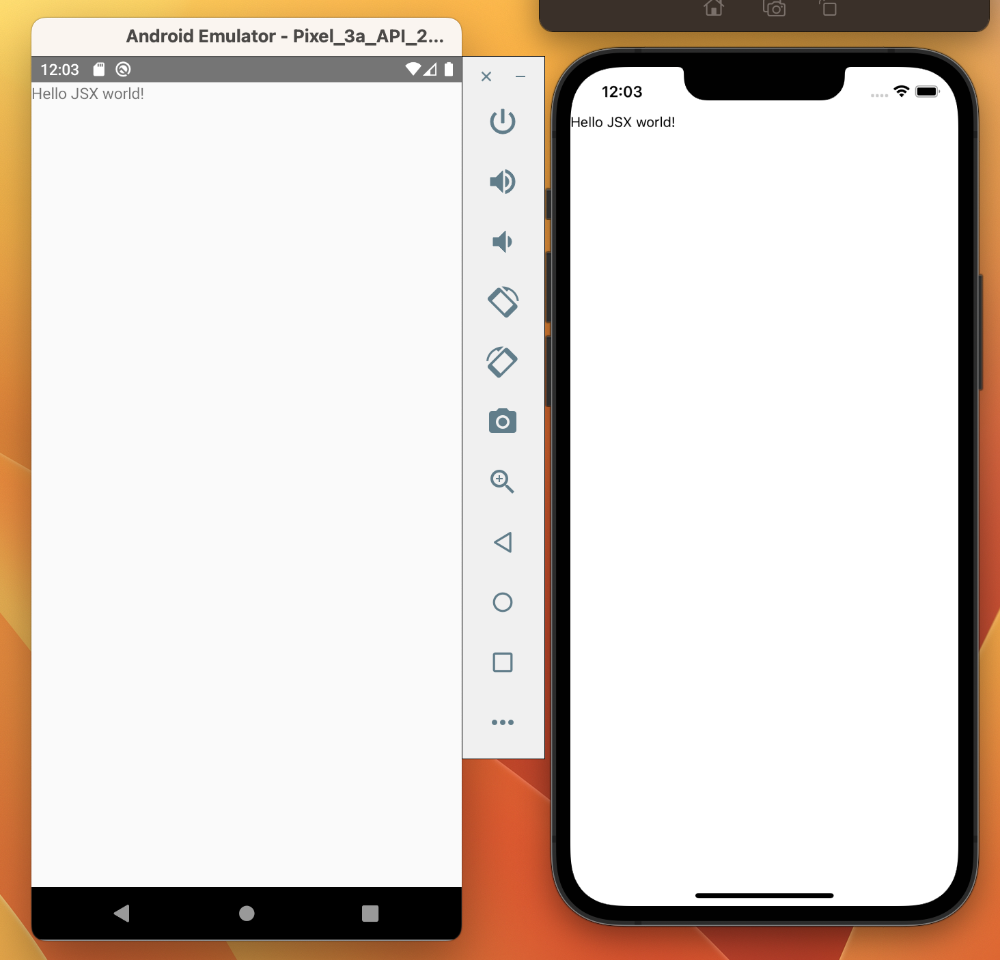

### React.createElement와 JSX 구문과의 관계

- createElement 사용 방법
  ⇒ `가상 DOM 객체 = createElement(컴포넌트_이름_또는_문자열, 속성_객체, 자식_컴포넌트)`

## 3. 컴포넌트와 속성 이해하기

---

> 컴포넌트와 속성을 알아보자

### 프로젝트 만들기

`npx react-native init ch02_3 --template react-native-template-typescript --npm`

### faker 외부 패키지 설치하기

[Faker | Faker](https://fakerjs.dev/)

- faker : 더미 데이터를 만드는 패키지
- 설치 : `npm install @faker-js/faker --save-dev`
- Trouble Shooting
  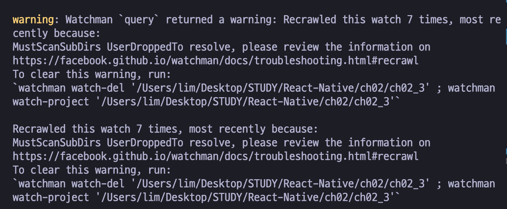
  워치맨 경고가 뜬 후 계속 실행이 안 됐다.
  - 디렉토리에 기존 watch 제거
    `watchman watch-del '/Users/lim/Desktop/STUDY/React-Native/ch02/ch02_3’`
  - 디렉토리에 대한 Watch 다시 생성
    `watchman watch-project '/Users/lim/Desktop/STUDY/React-Native/ch02/ch02_3’`

**createRandomPerson.ts**

```tsx
import type { IPerson } from './IPerson';
import * as F from './faker';
import * as U from './util';

export const createRandomPerson = (): IPerson => {
	const name = F.randomName();
	return {
		id: F.randomId(),
		createdDate: F.randomDate(),
		modifiedDate: new Date(),
		name,
		email: F.randomEmail(),
		avatar: F.randomAvatarUrl(name),
		image: F.randomImage(),
		comments: F.randomParagraphs(),
		counts: {
			comment: U.random(10, 100),
			retweet: U.random(10, 100),
			heart: U.random(100, 1000)
		}
	};
};
```

**faker.ts**

```tsx
import { faker } from '@faker-js/faker';
import * as U from './util';

export const randomId = (): string => faker.string.uuid();
export const randomName = (): string => faker.person.fullName();
export const randomEmail = (): string => faker.internet.email();
export const randomAvatarUrl = (name?: string): string => U.avatarUriByName(name ?? randomName());
export const randomDate = (): Date => faker.date.recent();
export const randomParagraphs = (count: number = 2): string => U.makeArray(count).map(faker.lorem.paragraph).join('\n');
export const randomImage = (): string => U.unsplashUrl(U.random(800, 1000), U.random(800, 1000));
```

**IPerson.ts**

```tsx
export type IPerson = {
	id: string;
	createdDate: Date;
	modifiedDate: Date;
	name: string;
	email: string;
	avatar: string;
	image: string;
	comments: string;
	counts: {
		comment: number;
		retweet: number;
		heart: number;
	};
};
```

**\*\***\*\*\*\***\*\***utils.ts**\*\***\*\*\*\***\*\***

```tsx
// length 크기의 빈 배열 만들기
export const makeArray = (length: number) => new Array(length).fill(null);

// min에서 max 사이의 랜덤한 정수 값 출력하기
export const random = (min: number, max: number): number => Math.round(Math.random() * (max - min)) + min;

// width, height 만큼의 이미지 url을 랜덤하게 얻기
export const unsplashUrl = (width: number, height: number): string => `https://source.unsplash.com/random/${width}x${height}`;

// 이름을 제공하면 아바타 이미지를 제공하기
export const avatarUriByName = (name: string) => `https://ui-avatars.com/api/?name=${name.split(' ').join('+')}`;
```

**index.ts**

```tsx
export * from './util';
export * from './faker';
export * from './IPerson';
export * from './createRandomPerson';
```

**실행해보자**

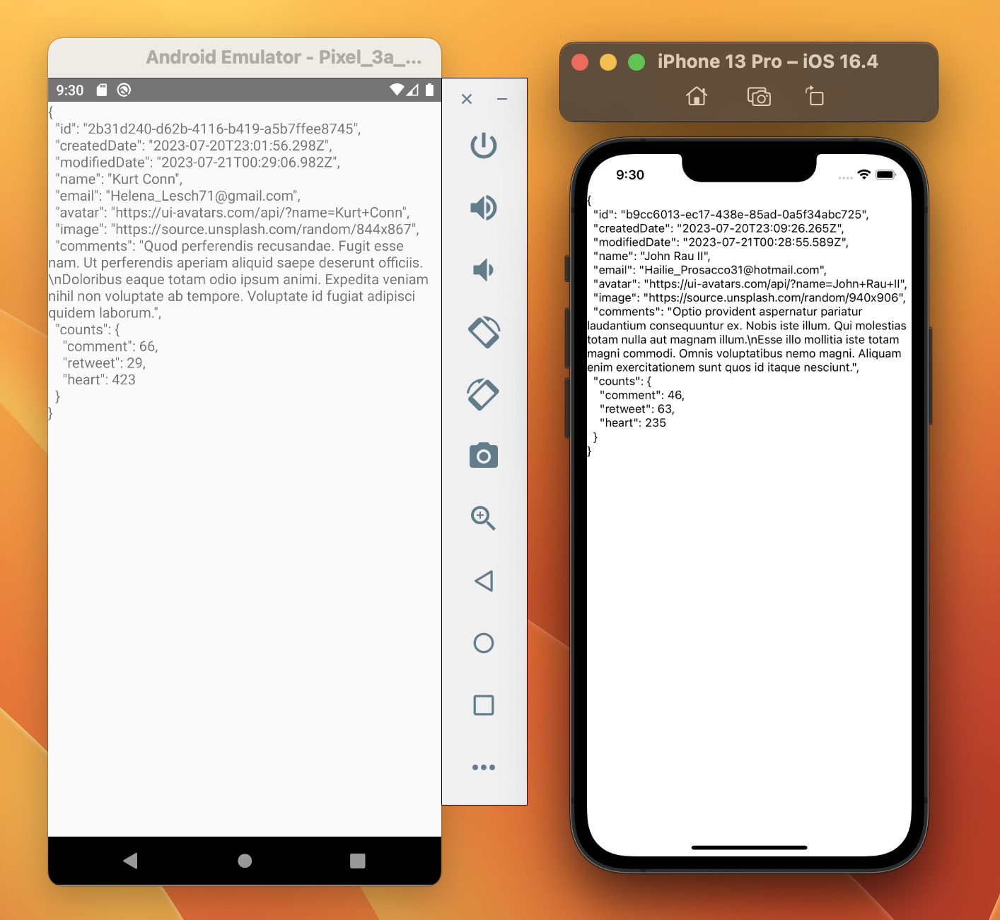

### 리액트 네이티브가 제공하는 두 가지 서비스

1. 코어 컴포넌트

   : 화면에 어떤 내용을 렌더링할 때 사용

2. API

   : 폰의 하드웨어나 운영체제가 제공하는 기능이 필요할 때 사용

<aside>
💡 **리액트는 자신만의 컴포넌트를 만들 수 있다. ⇒ 사용자 정의 컴포넌트**

</aside>

**[ 클래스 컴포넌트 만들기 ]**

**ClassComponent.tsx**

```tsx
import React, { Component } from 'react';
import { Text } from 'react-native';
import * as D from '../data';

const person = D.createRandomPerson();
export default class ClassComponent extends Component {
	render() {
		return <Text>{JSON.stringify(person, null, 2)}</Text>;
	}
}
```

<aside>
💡 **리액트와 리액트 네이티브에서 클래스 컴포넌트는 render 메서드를 가져야 한다.**

</aside>

- render 메서드는 null, undefined 또는 React.createElement 호출로 얻은 반환값이나 JSX문 중 하나를 반환해야 한다.

**App.tsx**

```tsx
import React from 'react';
import { SafeAreaView } from 'react-native';
import ClassComponent from './src/screens/ClassComponent';

export default function App() {
	return (
		<SafeAreaView>
			<ClassComponent />
		</SafeAreaView>
	);
}
```

**[ 화살표 방식 함수 컴포넌트 만들기 ]**

<aside>
💡 **보통 속성이 없는 컴포넌트는 function 키워드를 사용하고, 속성이 있다면 화살표 함수를 사용한다.**

</aside>

**ArrowComponent.tsx**

```tsx
import React from 'react';
import { Text } from 'react-native';
import * as D from '../data';

const person = D.createRandomPerson();
const ArrowComponent = () => {
	return <Text>{JSON.stringify(person, null, 2)}</Text>;
};

export default ArrowComponent;
```

**App.tsx**

```tsx
import React from 'react';
import { SafeAreaView } from 'react-native';
import ClassComponent from './src/screens/ClassComponent';
import ArrowComponent from './src/screens/ArrowComponent';

export default function App() {
	return (
		<SafeAreaView>
			<ClassComponent />
			<ArrowComponent />
		</SafeAreaView>
	);
}
```

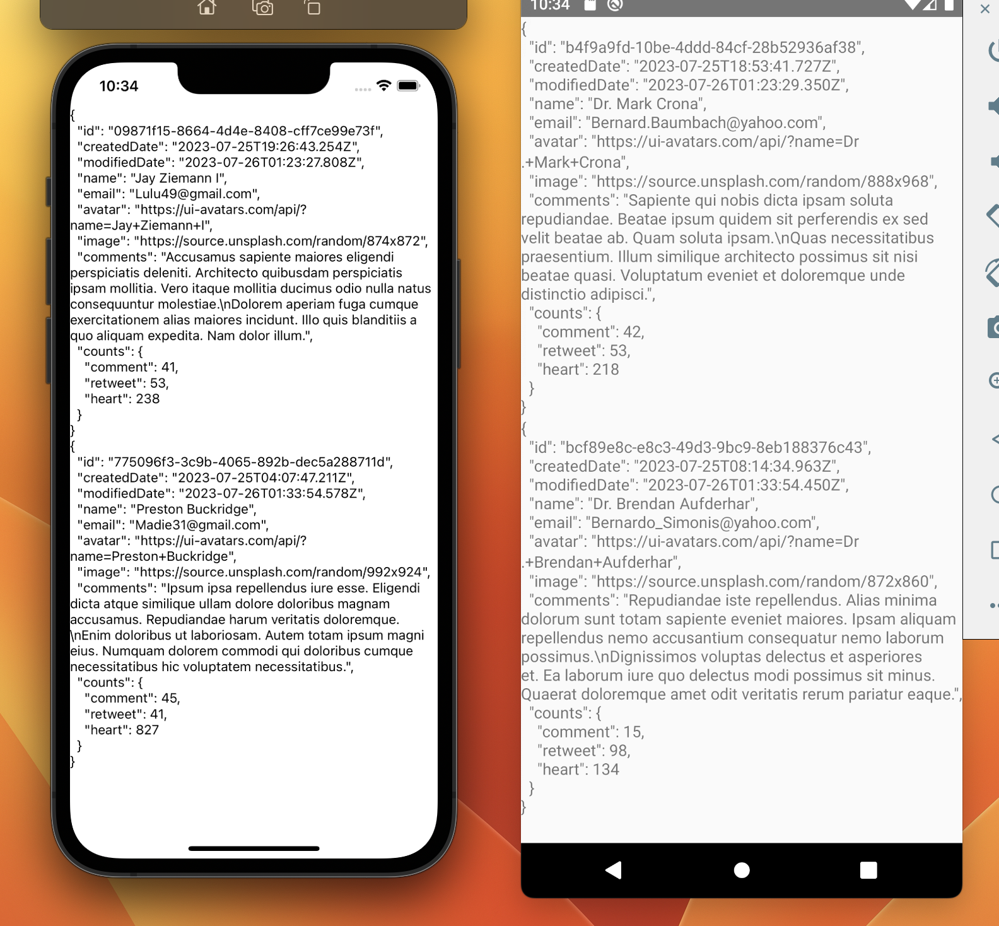

### 속성이란?

: 클래스의 멤버 변수

- 리액트 네이티브와 리액트는 컴포넌트의 속성이 바뀌면 이를 즉각 반영한다. → `재렌더링`

**[ JSX 속성 설정 구문 ]**

- 모든 속성은 `따옴표`로 감싸야 한다.

```jsx
<Person name='Jack' />
```

- string과 달리 number 타입은 중괄호 기호(`{ }`)로 감싸야 한다.

```jsx
<Person name='Jack' age={22} />
```

- 속성값이 객체라면 `중괄호 기호 두개` 사용(안쪽은 객체를 만드는 구문, 바깥쪽은 JSX 구문)

```jsx
<Person person={{ name: 'Jack', age: 32 }} />
```

### 함수 컴포넌트 타입

**[ 타입 스크립트로 함수 컴포넌트 구현하기 ]**

**Person.tsx**

```tsx
import React from 'react';
import type { FC } from 'react';
import * as D from '../data';
import { Text } from 'react-native';

export type PersonProps = {
	person: D.IPerson;
};

const Person: FC<PersonProps> = ({ person }) => {
	return <Text>{JSON.stringify(person, null, 2)}</Text>;
};

export default Person;
```

**App.tsx**

```tsx
import React from 'react';
import { SafeAreaView } from 'react-native';
import ClassComponent from './src/screens/ClassComponent';
import ArrowComponent from './src/screens/ArrowComponent';
import Person from './src/screens/Person';
import * as D from './src/data';

const person = D.createRandomPerson();
export default function App() {
	return (
		<SafeAreaView>
			<ClassComponent />
			<ArrowComponent />
			<Person person={person} />
		</SafeAreaView>
	);
}
```

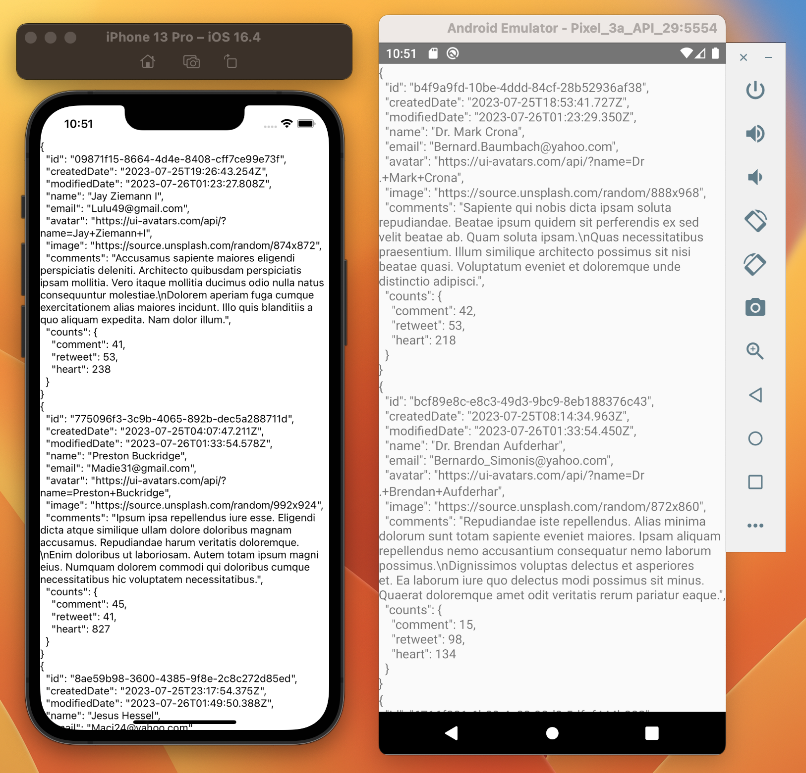

### ScrollView 코어 컴포넌트와 key 속성

- ScrollView 코어 컴포넌트
  : ScrollView의 자식 컴포넌트에 원하는 컴포넌트를 넣으면 스크롤 기능을 사용할 수 있다.

**App.tsx**

```tsx
import React from 'react';
import { SafeAreaView, ScrollView } from 'react-native';
import Person from './src/screens/Person';
import * as D from './src/data';

const people = D.makeArray(100).map(D.createRandomPerson);
export default function App() {
	const children = people.map((person) => <Person key={person.id} person={person} />);
	return (
		<SafeAreaView>
			<ScrollView>{children}</ScrollView>
		</SafeAreaView>
	);
}
```


<aside>
💡 **모든 리액트와 리액트 네이티브 컴포넌트는 `key`, `children`, `ref` 등 3개 속성을 기본으로 가진다.**

</aside>

- key : 리액트 프레임워크가 컴포넌트의 렌더링 속도를 최적화하는 데 필요한 속성이다.
  ⇒ 따라서 모든 자식 컴포넌트는 구분할 수 있는 키 값을 가져야 한다.

## 4. 컴포넌트의 이벤트 속성 이해하기

---

> 사용자가 버튼을 터치하거나 텍스트를 입력했을 때 발생하는 이벤트를 처리하는 방법을 알아보자

### 프로젝트 만들기

`npx react-native init ch02_4 --template react-native-template-typescript --npm`

### 이벤트 속성과 이벤트 처리기

- 이벤트 콜백 함수, 이벤트 처리기 : 이벤트 속성에 붙는 콜백 함수

**[ Button 코어 컴포넌트 ]**

```jsx
import { Button } from 'react-native';
```

- Button 코어 컴포넌트는 onPress 속성을 제공한다.

```jsx
<Button onPress={콜백_함수} />
```

- 콜백\_함수 형태는 다음과 같다

```jsx
콜백_함수 = () ⇒ { /* 함수 몸통 */ }
```

- 버튼에는 `title`과 [ `color` ] 속성을 제공한다.

```jsx
<Button title="home" color="blue" onPress={()=>console.log('home pressed.'} />
```

**[ Alert API ]**

API?

⇒ 리액트 네이티브에서 API는 JSX 구문에서 사용되는 코어 컴포넌트와 달리, 타입스크립트 코드에서 사용하는 기능을 의미한다.

```jsx
import { Alert } from 'react-native';
```

- Alert는 alert 정적 메시지를 제공해 해당 메서드를 호출하면 대화상자가 화면에 나타난다.

```jsx
static alert(타이틀, 메시지)
```

**[ 버튼을 누르면 대화상자가 나타나는 기능 ]**

**App.tsx**

```tsx
import React from 'react';
import { Alert, Button, SafeAreaView } from 'react-native';

export default function App() {
	return (
		<SafeAreaView>
			<Button title='Home' onPress={() => Alert.alert('home pressed.', 'message')} />
		</SafeAreaView>
	);
}
```


<aside>
⛔ **버튼의 디자인에 융통성이 없다.**

</aside>

**[ 터처블 코어 컴포넌트 ]**

- `TouchableOpacity`, `TouchableHighlight`
- 특징
  1. 컴포넌트 영역에 터치가 일어나는 onPress 이벤트 속성에 설정된 이벤트 핸들러 콜백 함수를 호출한다.
  2. 단 한개의 자식 컴포넌트만 올 수 있다.

**TouchableOpacity**

: 터치가 일어나면 컴포넌트 바탕색의 투명도를 바꾼다

**App.tsx**

```tsx
import React from 'react';
import { Alert, Button, SafeAreaView, Text, TouchableHighlight, TouchableOpacity } from 'react-native';

const onPress = () => Alert.alert('home pressed.', 'message');
export default function App() {
	return (
		<SafeAreaView>
			<Button title='Home' onPress={onPress} />
			<TouchableOpacity onPress={onPress}>
				<Text>TouchableOpacity</Text>
			</TouchableOpacity>
			<TouchableHighlight onPress={onPress}>
				<Text>TouchableHighlight</Text>
			</TouchableHighlight>
		</SafeAreaView>
	);
}
```


### TextInput 코어 컴포넌트

: 텍스트를 입력받는다.

```jsx
import { TextInput } from 'react-native';
```

- 특징
  1. `defaultValue` 속성에 초깃값을 설정할 수 있다.
  2. 입력된 텍스트는 `value` 속성값으로 얻을 수 있다.
  3. 텍스트가 입력될 때 `onChangeText` 이벤트 처리기를 실행한다.
     - 함수 시그니처
       ```jsx
       onChangeText(text: string) => void
       ```
  4. `placeholder` 속성을 사용하여 어떤 값을 설정해야 하는지 문자열로 출력할 수 있다.
  5. `editable` 속성값에 false를 설정하면 입력을 못하게(disable) 할 수 있다.
  6. `keyboardType` 속성에 ‘default’, ‘numeric’, ‘email-address’ 등의 값을 설정할 수 있다.
  7. 포커스를 가지게 하는 `focus` 메서드와 포커스를 잃게 하는 `blur` 메서드가 있다.
  8. 텍스트를 입력할 수 있는 상태(포커스를 가진 상태)가 되면 onFocus 이벤트를 호출하고 텍스트를 입력할 수 없는 상태(포커스를 잃을 상태)가 되면 onBlur 이벤트를 호출한다.
  9. 텍스트 입력이 모두 끝나면 `onEndEditing` 이벤트를 호출한다.
  10. 자식 요소를 가지지 못한다.

**App.tsx**

```tsx
import React from 'react';
import { Alert, Button, SafeAreaView, Text, TextInput, TouchableHighlight, TouchableOpacity } from 'react-native';

const onPress = () => Alert.alert('home pressed.', 'message');
export default function App() {
	return (
		<SafeAreaView>
			<Button title='Home' onPress={onPress} />
			<TouchableOpacity onPress={onPress}>
				<Text>TouchableOpacity</Text>
			</TouchableOpacity>
			<TouchableHighlight onPress={onPress}>
				<Text>TouchableHighlight</Text>
			</TouchableHighlight>
			<TextInput placeholder='enter your name' onChangeText={(text: string) => console.log(text)} onFocus={() => console.log('onFocus')} onBlur={() => console.log('onBlur')} onEndEditing={() => console.log('onEndEditing')} />
		</SafeAreaView>
	);
}
```


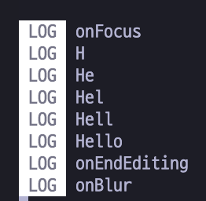

<aside>
💡 **함수 시그니처** : 함수 선언문에서 함수 이름만 제외한 부분

</aside>
