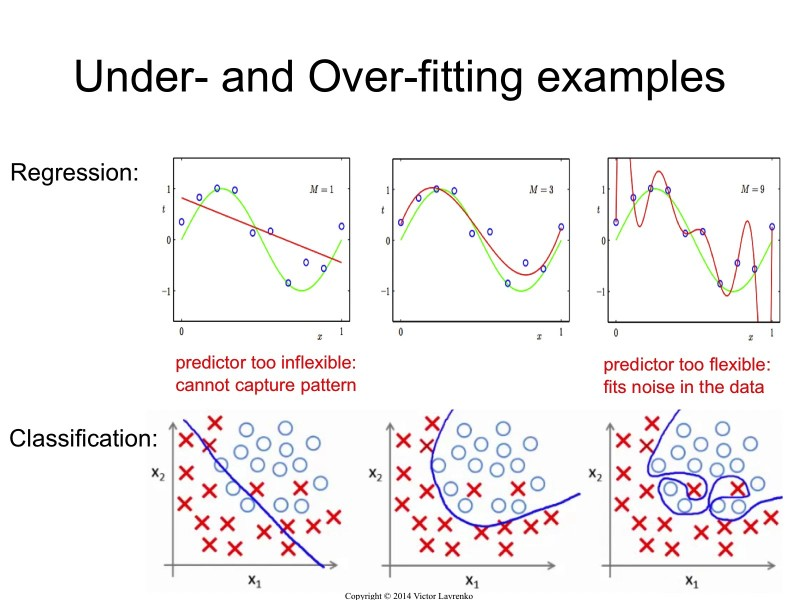

## 머신러닝

---

### 개요

- **AI**
  : 사람이 해야 할 일을 기계가 대신할 수 있는 모든 자동화에 해당
- **Machine Learning**
  : 명시적으로 규칙을 프로그래밍하지 않고 데이터로부터 의사결정을 위한 패턴을 기계가 스스로 학습
  - 딥러닝을 제외한 나머지 부분 → 정형 데이터 사용
  - 정규(정형) 데이터 : 엑셀과 같은 표 형식의 데이터
  - 귀납법
- **Deep Learning**
  : 인공신경망 기반의 모델로, 비정형 데이터로부터 특징 추출 및 판단까지 기계가 한 번에 수행

<aside>
💡 **머신러닝**

: 데이터(과거)에 숨겨진 정보와 규칙을 기계 스스로 습득하게 하고, 그 결과를 이용해서 새로운 입력(미래)을 예측하는 기술

</aside>

### 함수 근사

: 입력과 출력의 관계(규칙, Function)을 찾는다. (학습)

→ 처음보는 데이터에 대해서도 적합한 출력이 얻기 위함 (목적)

### 머신 러닝을 사용할 수 있는 경우

1. 데이터를 구축할 수 있어야 한다.
2. 데이터에 우리가 관심을 규칙이 있다고 판단될 때
3. 기존의 명시적인 프로그래밍 방법으로는 해결 방법이 없는 복잡한 문제

### 데이터 형식

- 정형 데이터 (Structured Data) : 표 형식
  - 데이터베이스, 스프레드시트, CSV 등
- 반정형 데이터 (Semi-Structured Data) ⇒ 정형으로 정제해서 사용한다.
  - XML, HTML 등
- 비정형 데이터 (Unstructured Data) ⇒ 딥러닝 알고리즘
  - 이미지, 동영상, 음성, 텍스트(SNS 등)

### 정형 데이터의 구조

s

- 관측치(데이터 row) : 샘플(Sample), 인스턴스(Instance)
- 변수(칼럼) : 각 관측치의 특성, (n차원 데이터)
  - 입력 : 독립변수, X, 특성, 피쳐
  - 출력 → 최종적으로 구하고 싶은 데이터 : 종속변수, Y, 타깃값, 라벨(분류의 경우), 클래스

### 데이터 종류

- 범주형 데이터 \*\*\*\*: 카테고리로 나눌 수 있는 데이터
  1. 순위형 데이터
     - ex. 등급
  2. 명목형 데이터
     - ex. 성별, 지역
- 수치 데이터

  1. 연속형 데이터

     : 소수점이 있는 데이터

     - ex. 키, 몸무게

  2. 이산형 데이터

     : 숫자로 표현하지만 숫자 사이에 숫자가 없는 상태

     - ex. 검사 횟수(1.5번 검사는 존재하지 않는다.)

### 머신러닝의 학습 방법

- 지도 학습 : 출력 값이 데이터 내에 존재하는 경우
- 비지도 학습 : 출력 값이 데이터 내에 존재하지 않는 경우
- 강화 학습

### 지도학습의 대표적인 경우

- 분류 (Classification)
  - 출력값이 범주형 일 때
    ⇒ 최소 속성이 3개 있어야 한다.
- 회기 (Regression)
  - 출력값이 연속형 일 때
    ⇒ 최소 속성이 2개 있어야 한다.

### 이진 분류 VS 다중 분류

- 이진 분류 (Binary Classification)
  : A냐 B냐. 둘 중 하나
- 다중 분류 (Multiclass Classification)
  : A, B, C 중 하나 등. 선택지가 세개 이상
  [레이블이 10개인 경우]
  - OvA(일대다) : 특정 숫자만 구분하는 숫자별 이진 분류기 10개를 훈련시켜 클래스가 10개인 분류기를 만든다.
  - OvO(일대일) : 0과 1 분류기, 0과 2 분류기, 1과 2 분류기 … 클래스가 N개라면 N x (N-1) / 2 개의 분류기를 만든다.

### 군집(Clustering) : 비지도 학습

- 타깃 변수가 없다.
- 특성이 비슷한 데이터들로 묶는다.

<aside>
💡 **좋은 모델이란?**

- 현재의 데이터(train data)를 잘 예측. (학습 시)
- 새로운 데이터(unobserved data)가 들어왔을 때에도 잘 예측. (`일반화`)
</aside>

### 과대적합(Overfitting) VS 과소적합(Underfitting)

: 모델을 지나치게 복잡하게 학습하여 학습 데이터셋에서는 모델 성능이 높게 나타나지만 정작 새로운 데이터가 주어졌을 때 정확한 예측/분류를 수행하지 못한다.

### Bias and Variance (편향과 분산)

### 학습용 데이터와 테스트 데이터

- 테스트 데이터는 학습에 사용되지 않는다.
- 검증용 데이터는 학습에 참여하고 있다.
  - Validation 데이터를 맞추기 위해 계속 학습

### 교차 검증 (Cross-Validation)

- 가장 적합한 모델을 선택하기 위한 방법으로 사용한다.
- 학습 세트를 여러 서브셋으로 나누고, 모델을 각 서브셋의 조합으로 훈련시키고, 검증한다.
- 학습이 끝나면 선택된 모델(최종 모델)을 전체 학습 세트로 학습시킨다.
  - 평균을 사용한다.

### 라벨 인코딩 (Label Encoding)

: 문자로 표현한 범주형 데이터를 숫자로 변환

- Y / N ⇒ 1 / 0
- 순위 같은 경우는 중요한 걸 큰 값으로, 덜 중요한 건 작은 값으로 한다.
- 혈액형(순서에 상관 x) ⇒ 원-핫 인코딩

**원-핫 인코딩 (One-Hot Encoding)**

: 머신러닝 알고리즘이 가까이 있는 두 값이 떨어져 있는 두 값보다 비슷하다고 판단하는 오류를 막기 위함.

- 큰 숫자를 중요하다고 판단할 수 있는 알고리즘의 동작을 막기 위함.

### 특성 스케일링

: 머신러닝 알고리즘은 입력 특성들의 스케일이 다르면 잘 동작하지 않는 경우가 많다.

- 0하고 1사이의 값으로 바꿔준다.

**Min-Max 스케일링 (최대 최소 정규화)**

: 최대값이 1, 최소값이 0, 나머지는 0~1사이의 값으로 바꾼다.

- 이상치에 많은 영향을 받는다.

**표준화 (Z-Score Normalization)**

: 평균이 0, 분산이 1이 되도록 변환한다.

- 이상치에 영향을 덜 받는다.
- 연속형 숫자에만 써야 한다.

### 이상치 (Outlier)

### 결측치

: 값이 없는 것

### 불균형 데이터 (Imbalanced Data)

- 데이터의 불균형이 생기면 학습이 잘 되지 않는다.

**[샘플링 기법]**

- 오버 샘플링 : 소수 클래스의 샘플을 늘린다.
  ex) Resampling, SMOTE, ADASYN 등
- 언더 샘플링 : 다수 클래스의 샘플을 줄인다.

### 오차 행렬 (혼동 행렬, Confusion Matrix)

- TP : 진짜 양성, 양성으로 예측했고, 정답도 양성
- FP : 가짜 양성, 양성으로 예측했고, 정답은 음성
- TN : 진짜 음성, 음성으로 예측했고, 정답도 음성
- FN : 가짜 음성, 음성으로 예측했고, 정답은 양성

- 민감도 (Sensitivity)
- 정밀도 (Precision)
- 정확도 (Accuracy)

### F1 점수 (F1 Score)

: 정밀도(Precision)와 재현율(Recall)을 하나의 숫자로 표현

- 조화평균 (역수의 평균)으로 표현

### ROC (Receiver Operationg Characteristics)

: Threshold 값을 변화시키면서, True Positive Ratio와 False Positive Ratio를 그래프로 나타낸 것.

- ROC 커프가 좌 상단에

### 회귀 알고리즘

: 오차를 최소가 되도록 모델(선의 식)을 최적화하는 것

- 오차(Error) : 실제 값과 예측 값의 차이
  ⇒ 양수로 만든다 (제곱, 절댓값)
- 평균 제곱 오차 (Mean Squared Error)
  - MSE (Mean Squared Error)
  - RMSE (Root Mean Squared Error)
  - MAE (Mean Absolute Error)

### 결정 계수 (R^2, R Square)

: 회귀 알고리즘 적용 전에, y값의 평균과 전체 데이터 사이의 오차를 계산.

### K-최근접 이웃 (K-Nearest Neighbor, KNN)

- 인스턴스 베이스
  : 제일 가까이 있는 이웃에 값을 따른다.
- 따로 학습이 있지는 않다.
- k : 인접한 데이터를 몇 개까지 탐색할 것인가?
- 거리 측정 : 데이터 사이의 거리는 어떻게 측정할 것인가?
- k=1인 경우는 과대적합이 발생한다.
- k값이 커질 수록 결정경계가 완만해지지만 과소적합이 발생할 수 있다.

### 유클리드 (Euclidean Distance)

- 가장 널리 사용되는 방법

### 맨하탄 거리 (Manhattan Distance)

## SVM (Support Vector Machine)

---

### 서포트 벡터 머신

- 머신러닝에서 가장 인기있는 모델
- 복잡한 분류 문제에 적합
- 선형, 비선형 분류 모두에 사용
- 회귀에 사용 가능

### 어떤 직선이 가장 좋은 직선인가?

- 이진분류가 main
- 2개의 클래스를 분류하는 수 많은 직선 중에서 어떤 직선을 골라야 하는가

### 서포트 벡터

- 최전선에 있는 값이 서포트 벡터
- 뒤에 있는 값을 안 보고, 가장 선두의 값만 보고 계산을 하기에 데이터가 많아져도 성능이 저하되지 않는다.
- 결정 경계(Hyperplane) : 두 데이터 최전선의 마진을 가장 넓게 차지하는 선(균등하게 나누는 선)

### 하드 마진 분류 (Hard Margin Classification)

: 모든 데이터가 서포터 벡터의 바깥에 존재하는 경우

- 데이터가 선형적으로 구분될 수 있어야 한다.
- 이상치에 민감하다.

### 소프트 마진 분류 (Soft Margin Classification)

: 에러를 고려하는 서포트 벡터 머신 모델

- softmargin을 사용한다는 것은 과적합을 막기 위한 규제이다.

### 손실 함수 조정

- C : 오류를 어느정도 허용할 지를 결정.
  - C값이 클 수록 하드 마진이고 작을 수록 소프트 마진이다.

### 다변량 데이터의 경우

- 결정경계(Decision)가 선이 아니라 면(초평면, Hyperplan)이 된다.

### 비선형 SVM 분류 : 커널 트릭 (Kernel Trick)

: 커널을 이용해서 차원을 바꿔 분류한다.

- 원래의 차원에서는 비선형 분류가 된다.
- 커널을
  - poly를 사용하는 경우 → degrees 파라미터 설정
  - rbf를 사용하는 경우 → gamma 값 설정
- rbf를 사용할 경우, C와 gamma 값이 클수록 결정경계면이 구불구불해진다.
- Gamma 값은 결정 경계를 얼마나 유연하게 가져갈지 지정한다.
  - 감마값이 높으면 훈련 데이터에 많이 의존하기 때문에, 결정 경계가 곡선형태를 띄며 과적합을 초래할 수 있다.
